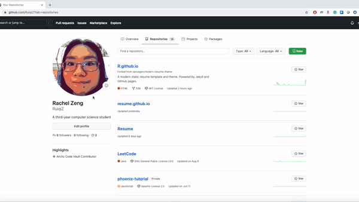

# How to Host Your Resume on Github

The purpose of this project is to provide the basic guidelines on how to host and format a resume on Github Pages using Markdown, a Markdown editor, Github Pages, and Jekyll. The steps are explained in a way to relate to the general principles of *Modern Technical Writing* from Andrew Etter. A demo is also provided with my own resume as an example.

[View Demo](https://ruiqiz.github.io)

### Table of Contents
- [Prerequisities](#prerequisities)
- [Instructions](#instructions)
- [More Resources](#more-resources)
- [Authors and Acknowledgements](#authors-and-acknowledgements)
- [FAQ](#faq)

## Prerequisities
- A [Github](https://github.com/) account
- A resume formatted in Markdown. Please see [More Resources](#more-resources) to find a Markdown tutorial\
Before we go into the instructions, let's clarify some questions. Why are we using Github? Github provides flexibility and ease of creating repository, common options, adding resources. What is a repository? A repository is the place where you put all of the resources for a project to run, including code, design, readme, etc.

## Instructions
### Step 1. Create a Github Repository	
1. Sign in to your [Github](https://github.com/login) account
2. Click `New` in `Repositories`
3. Give `Repository name` as `<username>.github.io`
4. Check off `Add a README file` in `Initialize this repository with` section at the bottom
5. Leave all other options by default
6. Click `Create repository`

Now you have created a public repository on Github! The idea behind Github repository is the distributed version control, which allows developers to work on the same repository at the same time, without affecting each other’s work. You can either clone the repository and work offline, or work directly online on your own version. This reduces the risk of accidentally modifying the original version. All these great features of distributed version control encourage developers to contribute together.

### Step 2. Create a Github Page
1. Click `Settings` in the repository you just created on the top bar
2. Scroll down to `GitHub Pages`
3. Select Branch under Source (eg. `main`)
4. Select a theme by clicking `Choose a theme`

Congratulations! You just successfully created a Github Page! Now let us go to your page `<username>.github.io`. It might take a minute or two to build the page.

Github Pages is designed to host your website page from the Github repository and it's static! A static website is the simplest website you can imagine because it has no server-side application dependencies, no databases, no installations. All it has is a server page, so we can easily create and move the entire site without any crashes. Basically, you can host a static website anywhere.

In order to host a resume, we need to do it slightly complex. We need to have a static site generator (Jekyll). The generator needs two things, contents (written in markdown) and a theme (_config.yml). Every time we edit the contents or the theme, the generator processes them to the working website.

### Step 3. Customize your page settings
1. Click the `_config.yml` file
2. Click the pencil icon on the top right corner of the code section to start editing
3. Select the branch you want to make changes to
4. Click `Save`

Github provides different theme templates if you don’t want to create a theme from scratch, which is friendly for beginners. When the theme is created, you will notice a `_config.yml` file is also created to the same repository. This yml config file contains different custom settings to the theme. Please see [More Resources](#more-resources) to find examples of custom settings. Once all changes are pushed to the branch, the generator will re-build the page.

### Step 4. Put resume into your page
1. Click the `README.md` file
2. Click the pencil icon to start editing
3. Rename to `README.md` to `index.md`
4. Select the branch you want to make changes to
5. Click `Save`

Jekyll renders Markdown format, so you can copy and paste your Markdown formatted resume to `index.md`

You probably wonder why we are using Markdown. Markdown is the most popular lightweight markup language in the world. Compare to other common web application languages, for example, HTML, XML, and JavaScript, Markdown requires the least amount of time to learn. Markdown also has the cleanest syntax to help format plain text. This gets rid of the hassles to click multiple buttons to try different styles of formatting compared to traditional editing tools, like MS Word. Etter states in the book that we should spend the most of our time on writing code, not fighting with different languages and tools on writing a document. As for Markdown editors,
I use Visual Studio Code for all coding needs. You can download a markdown extension that gives the side view, which allows you to preview the result in the side view panel while editing the markdown file.

## More Resources
Congratulations! Your resume is online! Here are more resoureces you might need.
- [Markdown tutorial](https://www.markdowntutorial.com/)
- Andrew Etter’s book [*Modern Technical Writing*](https://www.amazon.ca/Modern-Technical-Writing-Introduction-Documentation-ebook/dp/B01A2QL9SS)
- [Example of _config.yml settings](https://github.com/daattali/beautiful-jekyll/blob/master/_config.yml)

## Authors and Acknowledgements
- The resume template is provided by [sproogen/modern-resume-theme](https://github.com/sproogen/modern-resume-theme)
- Please see the list of authors [here](https://github.com/RuiqiZ/RuiqiZ.github.io/pulse)
- My group members: Anna Messejnikov, Jaskaran Singh, and Jasdeep Singh

## FAQ
**Why is Markdown better than a word processor?**\
Markdown formats plain text with a clean syntax without having to click multiple buttons to format text in different styles compared to a word processor.

**How to add new contents to my Github Pages?**\
Please see [Adding content to your GitHub Pages site using Jekyll](https://docs.github.com/en/free-pro-team@latest/github/working-with-github-pages/adding-content-to-your-github-pages-site-using-jekyll)

**Why is my resume not showing up?**\
Be sure to use the same Github username for `<username>.githhub.io`, otherwise the page will not work
